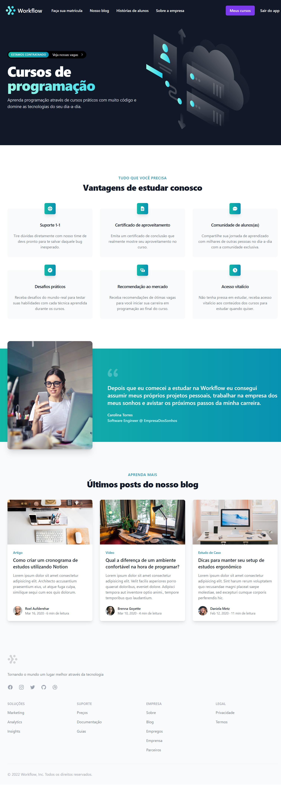

   

<h1 align="center">
Workflow
</h1>

## About

Workflow is a web learning platform for developers and designers developed during Ignite Lab 01 from @Rocketseat. This application follows the Microservices architecture and includes two services: Classroom and Purchases. 

The Classroom service is responsible for managing the courses, while the Purchases service is responsible for managing the purchases of the customers. Both services are implemented using the Apollo GraphQL framework. Services communicate each other through a Kafka Broker. On the frontend, the application is built using the Next.js framework and Tailwind CSS. 

## Features
- [x] Login
- [x] Logout
- [x] Register

- Purchases Service
  - [x] Create a product (admin only)
  - [x] List products (admin only)
  - [x] List of purchases (logged in only)
  - [x] Purchase a product (public)
  - [x] List products available for purchase (public)

- Classroom Service
  - [x] Create a course (admin only)
  - [x] List courses (admin only)
  - [x] List enrollments (admin only)
  - [x] List students (admin only)
  - [x] List courses I've bought (logged in only)
  - [x] Access a course (logged in only)

### Future Implementations
- [ ] Admin's Dashboard
- [ ] Course's internal pages
- [ ] Payment Gateway (Stripe)
- [ ] Lessons (video, code, etc) 

## Tech Stack
- **UI Library**: [React](https://reactjs.org/)
- **Front-end Framework**: [Next.js](https://nextjs.org/)
- **Styling**: [Tailwind CSS](https://tailwindcss.com/)
- **Runtime Environment**: [Node.js](https://nodejs.org/)
- **Back-end Framework**: [Nest.js](https://expressjs.com/)
- **API Query Language**: [GraphQL](https://graphql.org/)
- **GraphQL Provider**: [Apollo](https://www.apollographql.com/)
- **Authentication**: [Auth0](https://auth0.com/)
- **DBMS**: [PostgreSQL](https://www.postgresql.org/)
- **ORM**: [Prisma](https://www.prisma.io/)
- **Messaging**: [Apache Kafka](https://kafka.apache.org/)
- **Containerization**: [Docker](https://www.docker.com/)
- **Version Control System**: [Git](https://git-scm.com/)

## Screenshot

   

